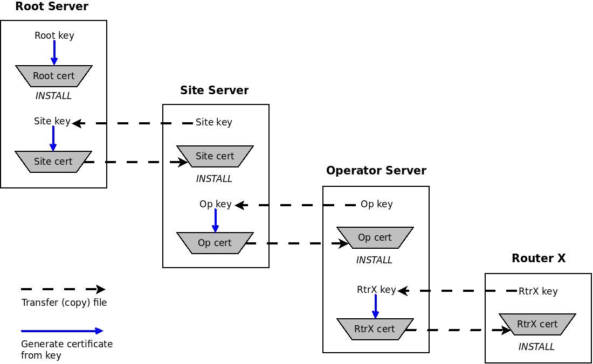
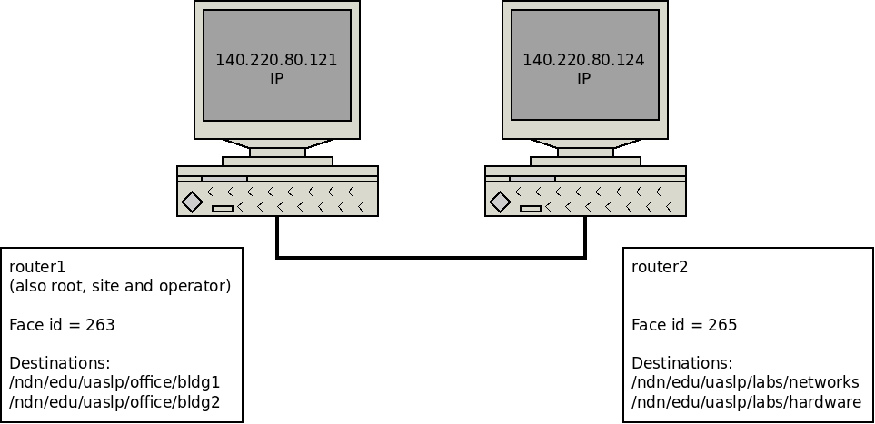

==========================================================
A beginners guide to installing and testing NLSR on Fedora
==========================================================

:Authors:  David Arjona-Villicaña, Octavio Renteria-Vidales, Ashlesh Gawande
:Date:     November, 2018
:Abstract: This is an easy to follow guide on how to install and test the NLSR routing protocol for NDN using two Fedora 28 machines. The commands and the paths used in this guide have been tested only in Fedora, although a similar procedure should be used for other linux systems. Specifically, the testing section (§ `5 <#test>`__) is platform independent. Therefore users who have NLSR already installed may skip to this section. Since neither NDN, NLSR nor Fedora are static software developments, it is expected that some commands and features in this guide will change over time. However, this guide is as accurate as it could be at the time it was published.

.. role:: raw-latex(raw)
   :format: latex

.. _intro:

1. Introduction
===============

The following instructions are based on the information provided at the
Named Data Networking project web page [NDNmain]_.
Before installing NLSR it is necessary to install different libraries and
programs: ndn-cxx, NFD, ChronoSync [optional], ndn-svs [optional] and PSync.
This document describes the necessary steps to correctly install these
programs (§ `2 <#ndncxx>`__, `3 <#nfd>`__ and `4 <#nlsr>`__) and a brief
guide on how to configure and test NLSR using a simple two-node
network (§ `5 <#test>`__).

Many of the commands in this guide need to be executed as *root*.
Starting from Fedora 28, there is no need to set a root user
[Kolman2018]_. However it is possible to define it,
using the following command:

::

      $ sudo -i

And then using the ``passwd`` command to set up a password. After setting
up the root user, it is possible to become root by employing the
following command and providing the root password when prompted:

::

      $ su -

Fedora employs the ``dnf`` command to install and verify installed
packages. The following commands may become useful during the
installation process and should be executed as root:

-  To verify that all installed packages are up to date

   ::

       $ dnf update

-  To verify if a package is already installed in the system

   ::

       $ dnf list --installed <package-name>

-  To search for information about a package or family of packages (not
   necessarily installed in the system).

   ::

       $ dnf info <package-name>

-  To install a package in the system.

   ::

       $ dnf install <package-name>

It is also a good installation practice to download and install all the
NDN programs in a common directory. Therefore, it is recommended to
create a directory at the home directory where all the following
programs may get installed. The name of this directory is not important.
However, the following are provided as suggestions: project, NDNproject,
NDNprograms. Each of the programs in the following sections should be
downloaded to their own directory using the ``git`` command, and then
compiled in this directory.

.. _ndncxx:

2. Installing ndn-cxx
=====================

2.1 Before installing ndn-cxx
-----------------------------

An updated list of the packages and programs that need to be installed
before installing ndn-cxx, is provided at [NDN-cxx]_.
This list is also reproduced below with the commands to verify that all
the packages have been installed in the system. The following commands
should be run as root:

#. gcc and gcc-c++

   ::

       $ dnf list --installed gcc
       $ dnf list --installed gcc-c++

#. Python version 3.8 or later

   ::

       $ python3 -V

#. SQLite 3.x

   ::

       $ dnf list --installed sqlite-devel

#. OpenSSL version 1.1.1 or later

   ::

       $ dnf list --installed openssl-devel

#. Boost libraries version 1.71.0 or later

   ::

       $ dnf list --installed boost-devel

#. pkgconf

   ::

       $ dnf list --installed pkgconf

#. git

   ::

       $ dnf list --installed git

#. doxygen (optional)

   ::

       $ dnf list --installed doxygen

#. graphviz (optional)

   ::

       $ dnf list --installed graphviz

#. python3-pip (optional)

   ::

       $ dnf list --installed python3-pip

#. After verifying that the python3-pip package has been installed, it
   is necessary to run the following command:

   ::

       $ python3 -m pip install -r docs/requirements.txt

2.2 Downloading and installing ndn-cxx
--------------------------------------

The ``git`` command allows to download the ndn-cxx library in its own
folder, also called *ndn-cxx*. Therefore it is recommended to execute
this command at the directory created at § `1 <#intro>`__:

::

      $ git clone --depth 1 https://github.com/named-data/ndn-cxx.git

Move to the ndn-cxx directory:

::

      $ cd ndn-cxx

Use the following command to verify that everything is ready to compile.
If an error message displays, it is necessary to fix it before
continuing:

::

      $ ./waf configure --with-examples

Compile the ndn-cxx library and install the compiled files at the
system's directories:

::

      $ ./waf
      $ sudo ./waf install

2.3 Configuring ndn-cxx
-----------------------

The commands in this subsection need to be run as root. First, it is
necessary to create file *local.conf*, which contains a line with the
location for the ndn-cxx library:

::

      $ echo /usr/local/lib64 >> /etc/ld.so.conf.d/local.conf

The following command configures the libraries:

::

      $ ldconfig -v | grep ndn

This command should display a line similar to the following:

::

         libndn-cxx.so.0.6.1 -> libndn-cxx.so.0.6.1

Configure the NDN path:

::

      $ echo export PKG_CONFIG_PATH=/usr/local/lib64/pkgconfig >> /etc/profile.d/ndn.sh

After this command has been executed, it is necessary to apply the
changes by either logging out and back in, and then running the
following command:

::

      $ printenv | grep PKG

Or by executing the following command:

::

      $ ./etc/profile.d/ndn.sh

For more information and examples about how to compile and configure
this library, users should read the ndn-cxx guide at
[NDN-cxx]_.

.. _nfd:

3. Installing NFD
=================

3.1 Before installing NFD
-------------------------

An updated list of the packages and programs that need to be installed
before NFD is provided at [NDNNFD]_. Before installing
NFD it is necessary to verify that the following packages are installed:

#. pcap library

   ::

       $ dnf list --installed libpcap-devel

3.2 Downloading and installing NFD
----------------------------------

This software is downloaded and installed in a folder called *NFD*, which
should be created at the directory defined at § `1 <#intro>`__. The
following commands need to be run as a regular user:

::

      $ git clone --depth 1 https://github.com/named-data/NFD.git
      $ cd NFD
      $ ./waf configure

If the previous command prints an error message saying that waf cannot
find WebSocket, it is necessary to follow the instructions provided by
this same output, which tells the user to run the following command:

::

      $ git submodule update --init

After executing these instructions, complete the configuration by running
``./waf configure`` again. Then complete the installation by means of the
following commands:

::

      $ ./waf
      $ sudo ./waf install

3.3 Configuring NFD
-------------------

Create a configuration file by running the following command as root:

::

      $ cp /usr/local/etc/ndn/nfd.conf.sample /usr/local/etc/ndn/nfd.conf

After the configuration file has been created, NFD's behavior may be
changed by modifying this file. Once the configuration file has been
created, it is recommended to start NFD by using the following command:

::

      $ nfd-start

This command does not properly allow to employ the command window to
enter new commands; however it displays the NFD logs. Therefore, it is
recommended to open a new command window. This second window may be used
to verify NDF's status and then stop NFD by using the following
commands:

::

      $ nfd-status
      $ nfd-stop

.. _nlsr:

4. Installing NLSR
==================

4.1 Installing PSync
--------------------

Before installing NLSR, it is also necessary to download and install
PSync. PSync is a synchronization library which allows NLSR to synchronize LSAs
similar to ChronoSync. More information about PSync may be found at [PSync]_.
This library may be installed by running the following commands as a regular
user and at the directory defined at § `1 <#intro>`__:

::

      $ git clone --depth 1 https://github.com/named-data/PSync.git
      $ cd PSync
      $ ./waf configure
      $ ./waf
      $ sudo ./waf install

The following command needs to be used again to configure the libraries:

::

      $ sudo ldconfig -v | grep -i psync

This command should display a line similar to the following:

::

         libPSync.so.0.1.0 -> libPSync.so.0.1.0

4.2 [Optional] Installing ChronoSync
------------------------------------

By default NLSR no longer builds with ChronoSync support.
Since ChronoSync is deprecated, only install it for testing purposes.

Before installing NLSR, it is necessary to first download and install
ChronoSync, which is a synchronization library which allows NLSR routers
to synchronize Link State Advertisements (LSAs). More information about
ChronoSync may be found at [Chronosync]_. This library may be
installed by running the following commands as a regular user and at the
directory defined at § `1 <#intro>`__:

::

      $ git clone --depth 1 https://github.com/named-data/ChronoSync.git
      $ cd ChronoSync
      $ ./waf configure
      $ ./waf
      $ sudo ./waf install

The following command needs to be used again to configure the libraries:

::

      $ sudo ldconfig -v | grep -i chronosync

This command should display a line similar to the following:

::

         libChronoSync.so.0.5.0 -> libChronoSync.so.0.5.0

4.3 [Optional] Installing SVS
-----------------------------

NLSR can also use State Vector Sync as the underlying Sync protocol,
using the ndn-svs library.

This library may be installed by running the following commands as a
regular user and at the directory defined at § `1 <#intro>`__:

::

      $ git clone --depth 1 https://github.com/named-data/ndn-svs.git
      $ cd ndn-svs
      $ ./waf configure
      $ ./waf
      $ sudo ./waf install

The following command needs to be used again to configure the libraries:

::

      $ sudo ldconfig -v | grep ndn-svs

This command should display a line similar to the following:

::

         libndn-svs.so.0.0.1 -> libndn-svs.so.0.0.1

4.4 Downloading and installing NLSR
-----------------------------------

NLSR is downloaded and installed in a folder called *NLSR* which should
be created at the directory defined at § `1 <#intro>`__. The following
commands need to be run as a regular user:

::

      $ git clone --depth 1 https://github.com/named-data/NLSR.git
      $ cd NLSR
      $ ./waf configure
      $ ./waf
      $ sudo ./waf install

If ChronoSync support is needed for testing, please configure NLSR with:

::

      $ ./waf configure --with-chronosync

4.5 Configuring NLSR
--------------------

Create and configure the following directory by running the following
commands as root:

::

      $ mkdir /var/lib/nlsr
      $ chmod 777 /var/lib/nlsr

.. _test:

5. Configuring and Testing NLSR
===============================

To test NLSR, the first step is to configure the keys and certificates
that implement a secure communication between the routers. Then it is
necessary to verify that the computers in the test network are
connected, that NFD is running and the faces between the computers are
configured. Finally, the NLSR configuration file has to be edited before
running NLSR. The following subsections are provided as a guide to
define and configure a simple computer network between two computers:
router1 and router2.

.. _security:

5.1 Setting up the security
---------------------------

Configuring security in an NDN network requires to generate, exchange
and install, keys and certificates between the root, site, operator and
router computers that form the network
[NLSRsecconf]_, [NLSRdevguide]_, although in practice, it
is possible to keep more than one of these entities in a single machine.
The following example and *Figure 1* show how to configure security
for a single router, called Router X. In this example, the root, site,
operator and Router X are in different computers:

   Fig. 1. Security configuration example for Router X.

#. At the root server, generate the root key:

   ::

       $ ndnsec-key-gen /ndn/ > root.key

#. Generate the certificate for the root key at the root server:

   ::

       $ ndnsec-cert-dump -i /ndn/ > root.cert

#. Install the root certificate at the root server:

   ::

       $ ndnsec-cert-install -f root.cert

#. At the site server, generate the site key:

   ::

       $ ndnsec-key-gen /ndn/edu/uaslp > site.key

#. Copy the site key to the root server and generate the certificate for
   the site server:

   ::

       $ ndnsec-cert-gen -s /ndn/ site.key > site.cert

#. Copy the site certificate to the site server and install it:

   ::

       $ ndnsec-cert-install -f site.cert

#. At the operator server, generate the operator key:

   ::

       $ ndnsec-key-gen /ndn/edu/uaslp/%C1.Operator/op > op.key

#. Copy the operator key to the site server and generate the certificate
   for the operator server:

   ::

       $ ndnsec-cert-gen -s /ndn/edu/uaslp op.key > op.cert

#. Copy the operator certificate to the operator server and install it:

   ::

       $ ndnsec-cert-install -f op.cert

#. At the router, generate the router key:

   ::

       $ ndnsec-key-gen /ndn/edu/uaslp/%C1.Router/routerX > routerX.key

#. Copy the router key to the operator server and generate the
   certificate for the router:

   ::

       $ ndnsec-cert-gen -s /ndn/edu/uaslp/%C1.Operator/op routerX.key >
         routerX.cert

#. Copy the router certificate to the router and install it:

   ::

       $ ndnsec-cert-install -f routerX.cert

In the previous steps, the *%C1.Router* and *%C1.Operator* labels are
NDN keywords and should not be changed. These labels will be also used
by the configuration file (§ `5.4 <#configfile>`__)

The following command may be used to verify that the certificates have
been installed in a computer:

::

      $ ndnsec-list

This guide recommends that one machine functions as the root, site,
operator and router1, while a different computer only functions as
router2. *Figure 2* shows this
configuration. For router1, the twelve steps described before need to be
executed except for exchanging files between computers. For the router2,
only steps 10 to 12 are needed to generate this router's certificate.

Additionally, the following command may be used to print a list and a
brief description of all the ``ndnsec`` commands:

::

      $ man ndnsec

   Fig. 2. Example network.

5.2 Configuring the network
---------------------------

The first step is to configure the physical network. If two computers
are going to get connected using a single Ethernet cable, it is
necessary to verify that this cable is a crossover. The other option is
to employ a switch between two computers that are then connected using
two regular Ethernet cables.

After the physical network has been assembled, it is necessary to
configure the network addresses and cards for all the computers in the
network. It is important to remember that computers that are connected
to each other should use the same subnetwork address. It is possible to
verify the network configuration in a Linux computer by means of the
``ip addr`` command.

Once the physical network and network cards have been configured, it is
necessary to verify that the computers can communicate with each other.
The simplest way to do this is by using the ``ping`` command:

::

      $ ping <remote-ip-address>

5.3 Starting and configuring NFD
--------------------------------

To start and configure NFD it is necessary to open two terminal windows.
The first one will be used to start NFD by means of the ``nfd-start``
command. This terminal will also display the logs that NFD generates. By
default, NFD only generates informational logs (INFO). However, it is
possible to obtain different levels of verbosity for these logs. These
levels can be set before NFD starts by editing the
*/usr/local/etc/ndn/nfd.conf* file. Open this file using a regular text
editor, read the information provided about logging and then modify the
*default-level* variable at the *log* section according to the
instructions provided in the file. Additional information about NFD
configuration may be found at [NDNNFDusage]_.

The second terminal will be used to monitor the NFD status:

::

      $ nfd-status

Employ the following command to configure each face that a computer uses
to connect to a neighboring computer:

::

      $ nfdc face create udp4://<remote-ip-address>

The face id may be displayed by running:

::

      $ nfdc face list

The status of the face may be verified by using the following command:

::

      $ nfdc face show id <face-id>

After finishing NLSR testing, it is necessary to destroy the face before
stopping NFD. This operation is described at § `5.6 <#turn_off>`__. For
the two computer network provided as an example (*Figure 2*), it is necessary that both
machines run NFD and that each one configures a face that connects to
the other machine.

.. _configfile:

5.4 Setting up the configuration file
-------------------------------------

Instructions on how to use the configuration file are already provided
at the NLSR's Router Configuration page [NLSRrtrconf]_.
Read the information in this page to understand NLSR router
configuration. The following text describes the instructions that have
been modified at the default nlsr.conf file for router1:

::

    ; AT general SECTION:
    {
      network /ndn/                    ; name of the network
      site /edu/uaslp                  ; name of the site
      router /%C1.Router/router1       ; name of the router: router1
    }

    ;AT neighbors SECTION:
    neighbors
    {
      neighbor
      {
        name /ndn/edu/uaslp/%C1.Router/router2   ; Neighbor router: router2
        face-uri  udp://140.220.80.124           ; face to the neighbor
        link-cost 30                             ; cost of the link
      }
    }

    ; AT advertising SECTION:
    advertising
    {
      prefix /ndn/edu/uaslp/office/bldg1         ; Advertising destinations
      prefix /ndn/edu/uaslp/office/bldg2         ; for router1
    }

    ; AT security SECTION:
    security
    {
      validator
      {
        ...
        trust-anchor
        {
          type file
          file-name "root.cert"        ; root certificate file
        }
      }

      prefix-update-validator
      {
        ...
        trust-anchor
        {
          type file
          file-name "site.cert"        ; site certificate file
        }
      }

      cert-to-publish "root.cert"      ; root certificate file

      cert-to-publish "site.cert"      ; site certificate file

      cert-to-publish "op.cert"        ; operator certificate file

      cert-to-publish "router1.cert"   ; router1 certificate file
    }

The following text shows the modified instructions for router2:

::

    ; AT general SECTION:
    {
      network /ndn/                    ; name of the network
      site /edu/uaslp                  ; name of the site
      router /%C1.Router/router2       ; name of the router: router2
    }

    ;AT neighbors SECTION:
    neighbors
    {
      neighbor
      {
        name /ndn/edu/uaslp/%C1.Router/router1   ; Neighbor router: router1
        face-uri  udp://140.220.80.121           ; face to the neighbor
        link-cost 30                             ; cost of the link
      }
    }

    ; AT advertising SECTION:
    advertising
    {
      prefix /ndn/edu/uaslp/labs/networks        ; Advertising destinations
      prefix /ndn/edu/uaslp/labs/hardware        ; for router2
    }

    ; AT security SECTION:
    security
    {
      validator
      {
        ...
        trust-anchor
        {
          type file
          file-name "root.cert"        ; root certificate file
        }                              ; this file needs to be copied to
      }                                ; router2

      prefix-update-validator
      {
        ...
        trust-anchor
        {
          type file
          file-name "site.cert"        ; site certificate file
        }                              ; this file needs to be copied to
      }                                ; router2

      ...
      cert-to-publish "router2.cert"   ; router2 certificate file
    }

Notice that files *root.cert* and *site.cert*, which were generated at
router1, need to be copied to router2. Also notice that the *%C1.Router*
and *%C1.Operator* keywords employed at § `5.1 <#security>`__ are also
referenced by these configuration files.

.. _starting_nlsr:

5.5 Starting NLSR
-----------------

It is recommended to open a third command terminal and run NLSR in this
window. After the NLSR configuration file has been edited and saved as
*nlsr.conf*, it is possible to start NLSR by running either of the
following two commands:

::

      $ nlsr
      $ nlsr -f <configuration-file>

However, to verify what is NLSR doing, it becomes necessary to employ
NLSR's logging facility [NLSRstarting]_. A brief
description on how to use NDN's logging facility may be displayed by
entering the ``man ndn-log`` command. This guide recommends using one
of the following two instructions to start NLSR:

::

      $ export NDN_LOG=nlsr.*=TRACE && nlsr
      $ export NDN_LOG=nlsr.*=TRACE && nlsr -f <configuration-file>

The second terminal window may be used to run ``nfd-status`` again and
it should be possible to verify that the status has changed, specially
at the FIB and RIB sections of the generated report.

.. _turn_off:

5.6 Turning everything off
--------------------------

In order to stop NLSR and NFD, the following sequence of events is
recommended:

#. Stop NLSR by pressing the Ctrl+C keys at the third terminal window.

#. Destroy the face to the remote computers using either of the
   following two commands at the second terminal window:

   ::

       $ nfdc face destroy <face-id>
       $ nfdc face destroy udp4://<remote-ip-address>

#. Stop NFD by entering the following command at the second terminal
   window:

   ::

       $ nfd-stop

#. The crossover Ethernet cable may be unplugged and the computers'
   network configuration restored to its original settings.

5.7 Where to go from here
-------------------------

Users interested in building and configuring larger networks may want to
take a look at the NDN Ansible repository
[NDNAnsible]_. This repository uses Ansible, which is a
configuration management tool, to manage the official NDN testbed
deployment [NDNTestbed]_.

.. [NDNmain] *Named Data Networking*, https://named-data.net/, March 2018.

.. [Kolman2018] M. Kolman. *Anaconda improvements in Fedora 28*, Fedora Magazine, June 2018.

.. [NDN-cxx] *Getting started with ndn-cxx*, https://docs.named-data.net/ndn-cxx/current/INSTALL.html, April 2018.

.. [NDNNFD] *Getting started with NFD*, https://docs.named-data.net/NFD/current/INSTALL.html, April 2018.

.. [NDNNFDusage] *NFD usage*, https://docs.named-data.net/NFD/current/manpages/nfd.html, May 2018.

.. [Chronosync] Z. Zhu and A. Afanasyev. *Let's ChronoSync: Decentralized dataset state synchronization in Named Data Networking*, in IEEE ICNP, October 2013.

.. [PSync] M. Zhang, V. Lehman, and L. Wang. *Scalable Name-based Data Synchronization for Named Data Networking*, in IEEE INFOCOM, May 2017.

.. [NLSRsecconf] *NLSR Security Configuration*, https://docs.named-data.net/NLSR/current/SECURITY-CONFIG.html June 2018.

.. [NLSRdevguide] V. Lehman, M. Chowdhury, N. Gordon, A. Gawande. *NLSR Developer's Guide*, University of Memphis, November 2017.

.. [NLSRrtrconf] *NLSR Router Configuration*, https://docs.named-data.net/NLSR/current/ROUTER-CONFIG.html, April 2018.

.. [NLSRstarting] *Getting Started with NLSR*, https://docs.named-data.net/NLSR/current/GETTING-STARTED.html, May 2018.

.. [NDNAnsible] *NDN Ansible repository*, https://github.com/WU-ARL/NDN_Ansible, October 2018.

.. [NDNTestbed] *NDN Testbed*, https://named-data.net/ndn-testbed/, October 2018.
